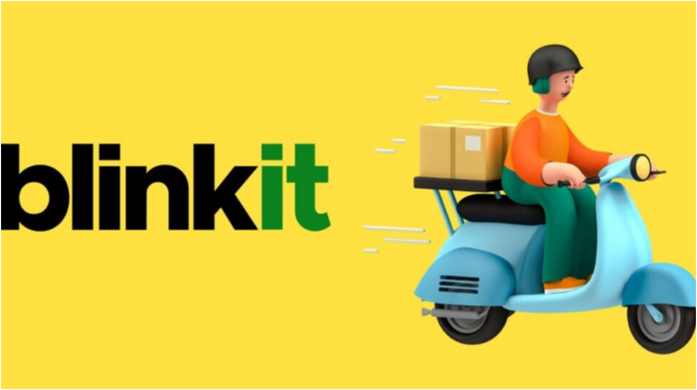
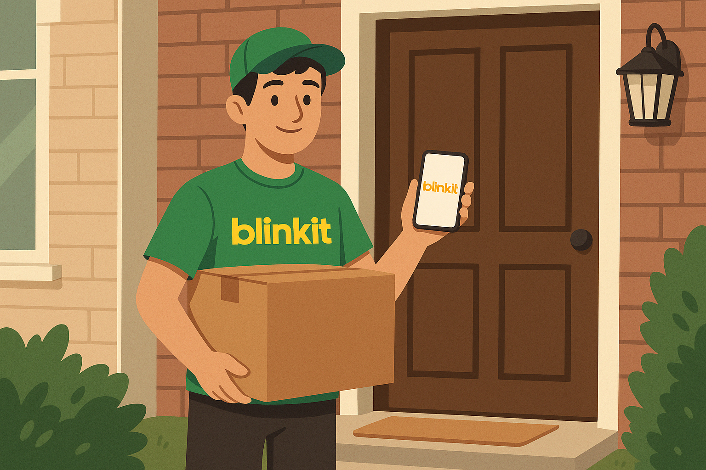
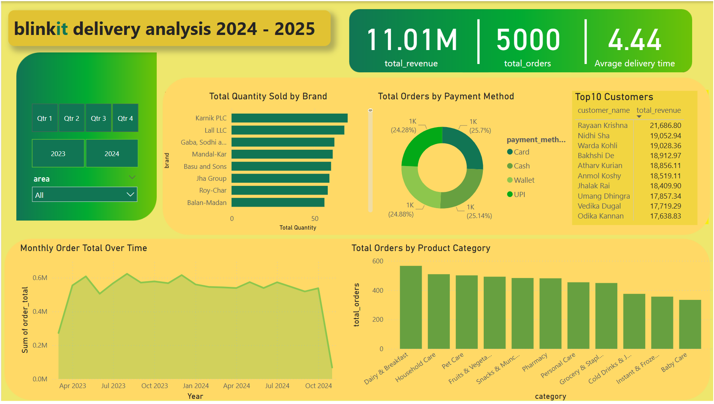
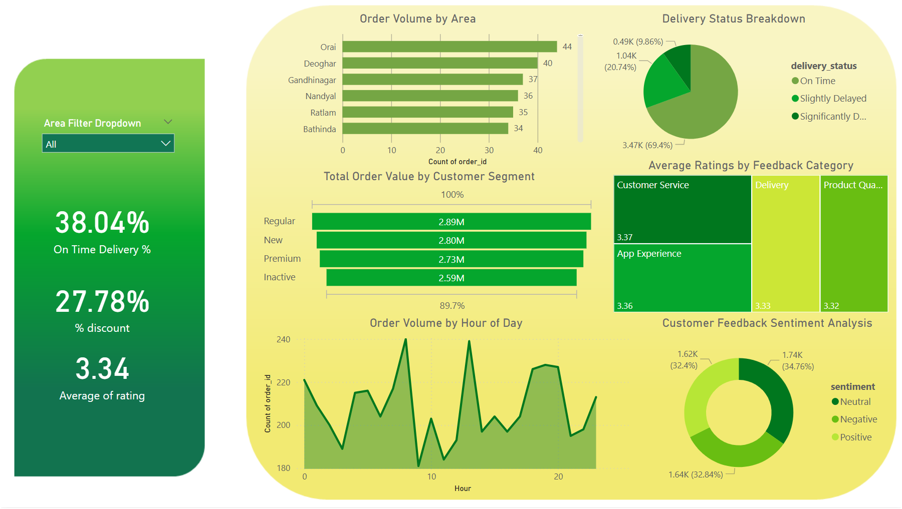

# Blinkit Delivery & Sales Analysis 🚚

An interactive Power BI dashboard analyzing Blinkit's delivery performance, customer segmentation, revenue, and order trends across Indian regions.

---

## 📊 Project Overview

This project presents an in-depth analysis of Blinkit's operations using Power BI. It highlights:

- On-time delivery performance
- Customer feedback insights
- Segment-wise revenue analysis
- Geospatial and time-based ordering patterns

---

## 🚚 Delivery & Order Insights

### On-Time Delivery Rate
- *Overall*: 38.04% (All Areas)
- *Ujjain Drillthrough: 77.14% on-time | Avg. delivery time: **3.8 hours*

### Delivery Status Breakdown
- *Significantly Delayed*: 69.4%  
- *Slightly Delayed*: 20.74%  
- *On Time*: 9.86%

### Hourly Order Trends
- Peak order times: *9 AM* & *6 PM*

---

## 👥 Customer Segmentation & Revenue

### Total Revenue by Segment
- *Regular*: ₹2.89M  
- *New*: ₹2.80M  
- *Premium*: ₹2.73M  
- *Inactive*: ₹2.59M

### Ujjain Drillthrough Revenue
- New: ₹10,375.89  
- Premium: ₹7,983.68  
- Regular: ₹2,228.58  
- *Total*: ₹20,588.15

> Click on any city in the dashboard to access *segment-wise revenue insights* via drillthrough.

---

## ⭐ Feedback & Ratings

### Average Rating by Category
- Customer Service: 3.37  
- App Experience: 3.36  
- Delivery: 3.33  
- Product Quality: 3.32  
- *Overall*: 3.34

### Sentiment Analysis
- *Positive*: 34.76%  
- *Neutral*: 32.84%  
- *Negative*: 32.4%

---

## 💸 Discounts & Promotions

- Average discount across all orders: *27.78%*

---

## 🧠 Key Takeaways

- *Logistics Challenge*: High delay rates signal a need for delivery optimization.
- *Loyal Customer Base*: Regular customers drive most revenue, suggesting strong brand engagement.
- *Balanced Sentiment*: Feedback distribution shows potential to boost positivity.
- *Time Trends*: Peak hours offer actionable insights for staffing and resource planning.
- *Drillthrough Capability*: Empowers location-specific analysis.

---

## ✅ Final Insights

1. *Delivery Optimization Needed* – Improve logistics to reduce delays.
2. *Effective Segment Strategy* – Strong returns from Regular, New, and Premium segments.
3. *Customer Feedback as a Compass* – Target areas like delivery and product quality.
4. *Drillthrough as a Strength* – Enables hyper-local insights and decisions.

---

## 📌 Dashboard Snapshots

  

---

## Made with ♥ using Power BI
